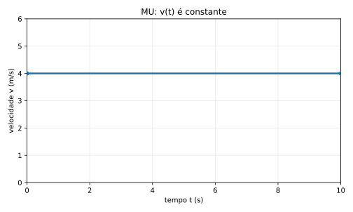

# 3. MU e MUV vistos pelos gráficos

Antes de derivar e integrar qualquer coisa, vale construir um olhar gráfico seguro.

Isso é importante porque, em cinemática, um gráfico não é um enfeite colocado depois da conta.  
Ele é uma forma de enxergar o movimento antes mesmo de escrever a fórmula final.

Quando você aprende a ler um gráfico de posição, velocidade ou aceleração, começa a perceber o movimento por três linguagens ao mesmo tempo:

- pela história física
- pela expressão algébrica
- pela forma geométrica da curva

Se a leitura de função, reta, inclinação e gráfico ainda estiver enferrujada, vale manter aberto o [Apêndice A](26-apendice-a-retas-graficos-e-funcoes.md).  
Ele foi pensado exatamente para sustentar estes capítulos iniciais.

## 3.1. MU — Movimento Uniforme

No **movimento uniforme**, a velocidade não muda com o tempo.

Isso significa o seguinte, em linguagem comum:  
em intervalos iguais de tempo, o móvel percorre deslocamentos iguais.

Se um carrinho anda a $4\ \text{m/s}$, então:

- em $1$ segundo, avança $4$ m
- em $2$ segundos, avança $8$ m
- em $3$ segundos, avança $12$ m

Perceba o padrão: a cada novo segundo, soma-se sempre a mesma quantidade de posição.

É por isso que, no MU, escrevemos:

$$
v(t) = v
$$

Ou seja, a função velocidade é constante.

Daí surge a forma:

$$
x(t) = x_0 + vt
$$

Por enquanto, leia essa expressão como o retrato algébrico do MU:

- $x_0$ diz de onde o móvel partiu
- $vt$ diz quanto ele acrescentou de posição depois de $t$ segundos

> A demonstração completa dessa fórmula virá na seção 9, quando o deslocamento for interpretado como área sob o gráfico $v \times t$.

### Como a reta aparece no gráfico x versus t

Considere um móvel com $x_0 = 10\ \text{m}$ e velocidade constante $v = 5\ \text{m/s}$.

Então:

- em $t=0$, ele está em $x=10$
- em $t=1$, ele está em $x=15$
- em $t=2$, ele está em $x=20$
- em $t=3$, ele está em $x=25$

Se marcarmos esses pontos no plano $(t,x)$, todos eles ficam alinhados.  
Quando isso acontece, o gráfico é uma **reta**.

Isso não é coincidência.  
Sempre que a posição cresce somando a mesma quantidade por unidade de tempo, o gráfico posição versus tempo tem comportamento linear.

Se essa relação entre “somar sempre o mesmo tanto” e “formar uma reta” ainda não estiver confortável, veja o [Apêndice A, seções A.3 e A.4](26-apendice-a-retas-graficos-e-funcoes.md).

### Uma animação para fixar a leitura do MU

<figure class="book-figure book-motion">
  <video class="book-video" controls muted loop playsinline preload="metadata" data-autoplay-when-visible>
    <source src="media/manim/mu_graphs_overview.mp4" type="video/mp4">
    Seu navegador não conseguiu reproduzir a animação.
  </video>
  <figcaption>No MU, os deslocamentos em tempos iguais são iguais; por isso x(t) vira reta, v(t) fica constante e a(t) fica nula.</figcaption>
</figure>

### Geometria do MU

No MU, os três gráficos típicos são estes:

- no gráfico $x \times t$, aparece uma **reta**
- no gráfico $v \times t$, aparece uma **linha horizontal**
- no gráfico $a \times t$, aparece a linha no zero

Gráfico $x \times t$:

Gráfico $v \times t$:

Gráfico $a \times t$:

### Como ler fisicamente cada gráfico do MU

Agora vale desacelerar e interpretar, porque é aqui que o gráfico começa a virar ferramenta de pensamento.

No gráfico $x \times t$:

- a posição cresce de forma regular
- a inclinação da reta é a velocidade
- quanto mais inclinada a reta, maior a velocidade em módulo

No gráfico $v \times t$:

- a velocidade não muda
- por isso o gráfico é horizontal
- a altura da linha diz qual é o valor constante da velocidade

No gráfico $a \times t$:

- a aceleração é zero
- isso quer dizer que não há ganho nem perda de velocidade ao longo do tempo

### Um detalhe que costuma confundir

Muita gente olha para o gráfico $x \times t$ e pensa:  
“se o gráfico está subindo, então o móvel está acelerando”.

Isso está errado.

No gráfico posição versus tempo, subir apenas quer dizer que a posição está aumentando.  
Para decidir se há aceleração, você precisa observar se a **inclinação** da curva está mudando.

No MU, a inclinação não muda.  
Então o movimento pode até estar indo para frente, mas não está acelerando.

### Leitura física da inclinação

A inclinação dessa reta no gráfico $x \times t$ é a velocidade.

- reta mais inclinada $\Rightarrow$ maior velocidade
- reta menos inclinada $\Rightarrow$ menor velocidade
- reta descendo $\Rightarrow$ velocidade negativa

Se a palavra “inclinação” ainda estiver muito geométrica e pouco intuitiva, veja novamente o [Apêndice A, seção A.4](26-apendice-a-retas-graficos-e-funcoes.md).

---

## 3.2. MUV — Movimento Uniformemente Variado

No **movimento uniformemente variado**, o valor constante não é a velocidade.  
O valor constante agora é a aceleração.

Em símbolos:

$$
a(t) = a
$$

Fisicamente, isso significa:

- em intervalos iguais de tempo, a velocidade muda sempre da mesma quantidade

Por exemplo, se $a = 2\ \text{m/s}^2$, então a velocidade cresce $2\ \text{m/s}$ a cada segundo:

- depois de $1$ s, aumentou $2\ \text{m/s}$
- depois de $2$ s, aumentou $4\ \text{m/s}$
- depois de $3$ s, aumentou $6\ \text{m/s}$

É por isso que a velocidade no MUV é escrita como:

$$
v(t) = v_0 + at
$$

Ainda não estamos demonstrando formalmente essa fórmula.  
Estamos identificando o padrão físico que ela descreve.

> A forma $v(t)=v_0+at$ será justificada na seção 12.2.

### Por que a posição deixa de ser reta

Aqui entra a diferença essencial entre MU e MUV.

No MU:

- a velocidade é sempre a mesma
- então, a cada segundo, a posição cresce pelo mesmo tanto
- resultado: o gráfico $x \times t$ é uma reta

No MUV:

- a velocidade vai mudando
- então, a cada novo segundo, o ganho de posição já não é igual ao anterior
- resultado: o gráfico $x \times t$ deixa de ser reta e vira curva

Essa curva, no caso do MUV, é parabólica:

$$
x(t) = x_0 + v_0 t + \frac{1}{2}at^2
$$

O termo $\frac{1}{2}at^2$ é justamente o sinal algébrico de que o crescimento já não é linear.

> A construção dessa expressão virá na seção 10 e será retomada formalmente na seção 12.1.

### Uma animação para enxergar o salto do MU para o MUV

<figure class="book-figure book-motion">
  <video class="book-video" controls muted loop playsinline preload="metadata" data-autoplay-when-visible>
    <source src="media/manim/muv_graphs_overview.mp4" type="video/mp4">
    Seu navegador não conseguiu reproduzir a animação.
  </video>
  <figcaption>No MUV, as posições ficam cada vez mais espaçadas, v(t) vira reta e a(t) permanece constante.</figcaption>
</figure>

### Um mesmo instante visto nos três gráficos

Uma dificuldade muito comum no começo é olhar $x(t)$, $v(t)$ e $a(t)$ como se fossem três histórias separadas.

Mas não são.

Quando escolhemos um instante $t$, esse mesmo valor de tempo aponta:

- um ponto no gráfico da posição
- um ponto no gráfico da velocidade
- um ponto no gráfico da aceleração
- e, fisicamente, um estado do movimento naquele momento

Na animação abaixo, o tempo varre o movimento e deixa claro que o carrinho, a posição no eixo $S$ e os três gráficos estão sincronizados.

<figure class="book-figure book-motion">
  <video class="book-video" controls muted loop playsinline preload="metadata" data-autoplay-when-visible>
    <source src="media/manim/kinematics_time_sweep.mp4" type="video/mp4">
    Seu navegador não conseguiu reproduzir a animação.
  </video>
  <figcaption>O mesmo instante t gera uma leitura simultânea em x(t), v(t) e a(t): um ponto em cada gráfico e uma posição correspondente no eixo do movimento.</figcaption>
</figure>

### Geometria do MUV

No MUV, os três gráficos típicos ficam assim:

- no gráfico $a \times t$, temos uma linha horizontal
- no gráfico $v \times t$, temos uma **reta**
- no gráfico $x \times t$, temos uma **curva parabólica**

Gráfico $x \times t$:

Gráfico $v \times t$:

Gráfico $a \times t$:

### O que cada gráfico está dizendo

No gráfico $a \times t$, a mensagem é a mais direta:

- a aceleração não muda
- por isso a linha é horizontal

No gráfico $v \times t$, a mensagem é:

- a velocidade muda de modo regular
- por isso o gráfico é uma reta
- a inclinação dessa reta mede a aceleração

No gráfico $x \times t$, a mensagem é:

- como a velocidade está mudando, o crescimento da posição vai ficando diferente ao longo do tempo
- por isso a curva “abre” e não permanece reta

Esse ponto costuma ser decisivo para o aluno:

- reta em $x(t)$ sugere velocidade constante
- curva em $x(t)$ sugere velocidade variando

Não é toda curva que representa MUV, mas todo MUV clássico produz esse tipo de curvatura parabólica.

Se quiser reforçar a relação entre reta, coeficiente angular e forma do gráfico, consulte o [Apêndice A, seções A.3, A.4 e A.5](26-apendice-a-retas-graficos-e-funcoes.md).

---

## 3.3. Comparação direta entre MU e MUV

Vale deixar o contraste totalmente explícito:

| Ideia | MU | MUV |
| --- | --- | --- |
| Grandeza constante | velocidade | aceleração |
| Como a velocidade se comporta | não muda | muda linearmente |
| Como a posição cresce | em passos iguais | em passos cada vez diferentes |
| Forma de $x(t)$ | reta | parábola |
| Forma de $v(t)$ | linha horizontal | reta |
| Forma de $a(t)$ | zero | constante |

Essa tabela parece simples, mas ela organiza quase todo o raciocínio inicial do curso.

Quando você olha para um problema, uma das primeiras perguntas úteis é:

> “o que está constante aqui: a velocidade ou a aceleração?”

Se a resposta for “velocidade”, você está olhando para um quadro de MU.  
Se a resposta for “aceleração”, você está olhando para um quadro de MUV.

Nos próximos capítulos, vamos transformar essa leitura geométrica em linguagem de cálculo.  
Primeiro, pela ideia de velocidade média e instantânea; depois, pela derivada e pela integral.

---
