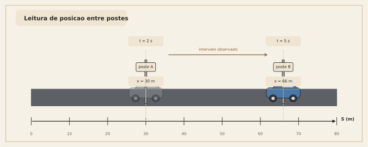
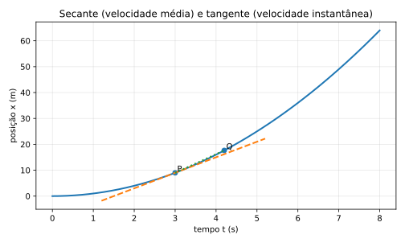

# 4. Velocidade média e velocidade instantânea

Aqui começa o cálculo de verdade.

## 4.1. Velocidade média

Em um intervalo de tempo $\Delta t$, a velocidade média é:

$$
v_{\text{méd}} = \frac{\Delta x}{\Delta t}
$$

Aqui aparecem duas abreviações:

- $\Delta x$ = variação de posição
- $\Delta t$ = variação de tempo

Se o intervalo começa no instante $t$ e termina no instante $t+\Delta t$, então:

- posição inicial = $x(t)$
- posição final = $x(t+\Delta t)$
- tempo inicial = $t$
- tempo final = $t+\Delta t$

Usamos agora duas ideias matemáticas bem simples:

1. variação = valor final $-$ valor inicial
2. a posição é dada por uma função do tempo, escrita como $x(t)$

Logo,

$$
\Delta x = x(t+\Delta t) - x(t)
$$

e

$$
\Delta t = (t+\Delta t) - t
$$

Substituindo essas duas escritas na fórmula compacta, obtemos:

$$
v_{\text{méd}}
=
\frac{x(t+\Delta t)-x(t)}{(t+\Delta t)-t}
=
\frac{x(t+\Delta t)-x(t)}{\Delta t}
$$

Essa forma parece mais carregada, mas não é uma nova fórmula.  
É a mesma velocidade média escrita em linguagem de função.

Na seção 4.2, vamos usar exatamente essa escrita para encolher o intervalo e chegar à velocidade instantânea.

Isso responde:

> “Em média, quanto a posição mudou por unidade de tempo nesse intervalo?”

### Exemplo físico
Imagine um carro entre dois postes de medição:

- em $t = 2\,s$, ele está em $x=30\,m$
- em $t = 5\,s$, ele está em $x=66\,m$

Então:

$$
v_{\text{méd}} = \frac{66-30}{5-2} = \frac{36}{3} = 12\ \text{m/s}
$$

Isso não significa necessariamente que ele estava a $12\ \text{m/s}$ o tempo todo.  
Significa apenas que **o efeito médio** naquele intervalo foi esse.

---

## 4.2. O salto conceitual: e se eu encolher o intervalo?

Agora vem a ideia de limite.

Se eu quiser a velocidade **num instante**, eu posso pegar um intervalo muito pequeno em torno daquele instante.

Em vez de olhar o comportamento entre tempos bem separados, eu olho assim:

$$
v_{\text{méd}} = \frac{x(t+\Delta t)-x(t)}{\Delta t}
$$

e vou tornando $\Delta t$ cada vez menor:

$$
\Delta t \to 0
$$

Quando esse processo funciona, nasce a **velocidade instantânea**:

$$
v(t) = \lim_{\Delta t \to 0}\frac{x(t+\Delta t)-x(t)}{\Delta t}
$$

Essa é a definição de derivada aplicada à posição.

> Em linguagem intuitiva:
>
> a velocidade instantânea é a velocidade média em um intervalo tão pequeno que ele “encosta” num único instante.

---

## 4.3. Visão geométrica: secante e tangente

No gráfico $x \times t$:

- a **velocidade média** é a inclinação da reta secante entre dois pontos
- a **velocidade instantânea** é a inclinação da reta tangente naquele ponto

### Leitura física
Isso é belíssimo porque une duas linguagens:

- linguagem física: “rapidez de mudança”
- linguagem geométrica: “inclinação da curva”

Na prática:

- inclinação grande $\Rightarrow$ velocidade grande
- inclinação nula $\Rightarrow$ velocidade zero
- inclinação negativa $\Rightarrow$ velocidade negativa

---
