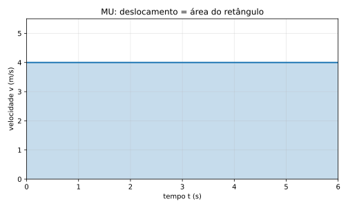

# 9. Integral no MU: por que x = x0 + vt?

Chegou a hora de justificar geometricamente a fórmula clássica do MU.

No movimento uniforme, a velocidade é constante:

$$
v(t)=v
$$

Isso significa que o gráfico $v \times t$ é uma linha horizontal.

## 9.1. O que queremos descobrir

Se conhecemos a velocidade constante e queremos saber a posição depois de um intervalo de duração $t$, a pergunta física é:

> quanto foi acumulado de deslocamento nesse intervalo?

Pela leitura geométrica da integral, isso corresponde à área sob o gráfico de velocidade.

## 9.2. O gráfico do MU produz um retângulo

Como a velocidade é constante, o gráfico $v \times t$ forma um retângulo.

Nesse retângulo:

- a base vale $t$
- a altura vale $v$

Então a área é:

$$
\Delta x = v \cdot t
$$

Essa área é justamente o deslocamento acumulado.

## 9.3. Passando do deslocamento para a posição

Até aqui, encontramos a variação de posição:

$$
\Delta x = vt
$$

Mas posição final não é a mesma coisa que deslocamento.

Precisamos lembrar que:

$$
\text{posição final} = \text{posição inicial} + \text{deslocamento}
$$

Em símbolos:

$$
x = x_0 + \Delta x
$$

Substituindo $\Delta x = vt$:

$$
x = x_0 + vt
$$

## 9.4. O sentido físico da fórmula

Essa dedução vale a pena porque mostra que a equação horária do MU não é uma frase arbitrária.

Cada termo tem papel claro:

- $x_0$ diz de onde o móvel partiu
- $vt$ diz quanto ele acrescentou de posição ao longo do tempo

Se o corpo já começa em um ponto diferente de zero, a fórmula incorpora isso.  
Se a velocidade muda, então já não estamos mais no MU e a forma deixa de ser suficiente.

## 9.5. Um exemplo curto

Suponha que uma caixa comece em $x_0=3$ m e siga com velocidade constante de $2$ m/s por $6$ s.

Então:

$$
\Delta x = vt = 2\cdot 6 = 12
$$

Logo:

$$
x = x_0 + \Delta x = 3 + 12 = 15
$$

Perceba como o gráfico e a fórmula contam a mesma história:

- o retângulo dá o deslocamento
- o termo inicial recoloca o móvel em seu ponto de partida real

## 9.6. O que este capítulo entregou

Agora a equação

$$
x = x_0 + vt
$$

deixou de ser apenas “a fórmula do MU”.

Ela passou a ser entendida como:

> posição inicial + área do retângulo sob o gráfico $v \times t$

Esse é exatamente o espírito do livro: transformar fórmula pronta em leitura geométrica com significado físico.

---
