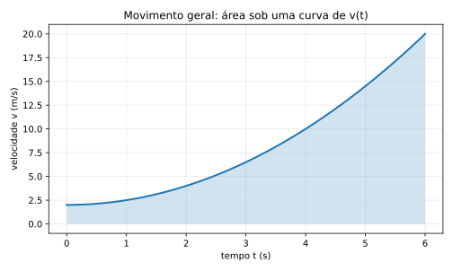

# 14. Um comentário sobre curvas: só o necessário

Até agora, trabalhamos sobretudo com casos muito bem comportados:

- MU: velocidade constante
- MUV: velocidade linear no tempo

Mas vale registrar a regra mais geral.

## 14.1. Quando o gráfico de velocidade é uma curva qualquer

Se $v(t)$ não for uma reta, mas uma curva qualquer, a regra geral continua válida:

$$
\Delta x = \int_{t_1}^{t_2} v(t)\,dt
$$

Geometricamente:

- área sob a curva de $v \times t$ = deslocamento

Ou seja, a interpretação de área não depende de a curva ser reta.  
Ela continua funcionando quando o movimento fica mais complicado.

## 14.2. Por que então focamos em MU e MUV?

Porque eles já concentram o essencial do raciocínio:

- leitura de gráfico
- interpretação de inclinação
- interpretação de área
- uso prático de derivada e integral

Além disso, MU e MUV cobrem uma enorme parte da cinemática básica que aparece em cursos iniciais.

## 14.3. O limite certo deste livro

Este material não pretende esgotar movimentos arbitrários.

O foco principal é:

- MU: $v(t)$ constante
- MUV: $v(t)$ linear

Mesmo ficando nesse recorte, você já ganha o pedaço mais útil do cálculo para a cinemática elementar e intermediária.

## 14.4. O que vale guardar

Se precisar levar só uma frase deste capítulo, leve esta:

> área sob o gráfico $v \times t$ continua significando deslocamento, mesmo quando o gráfico deixa de ser simples

Essa ideia será útil sempre que você encontrar movimentos menos “escolares” e mais reais.

---
