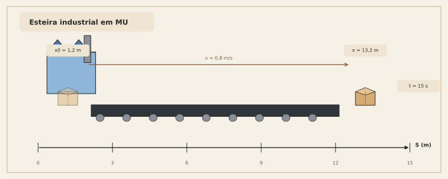
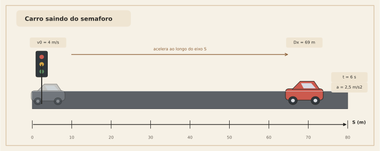
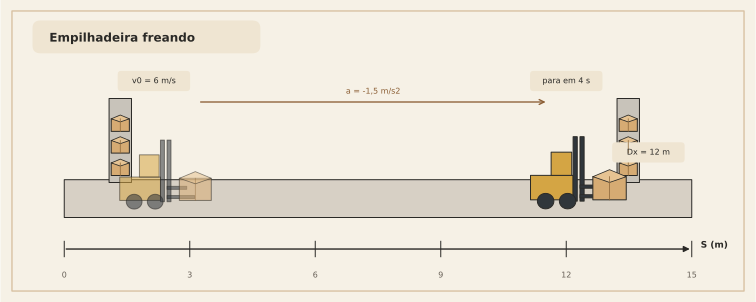
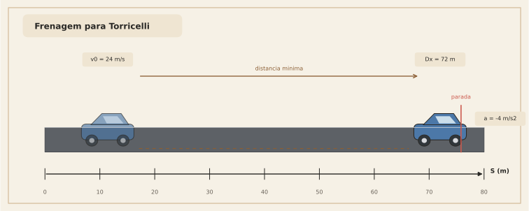

# 17. Exemplos físicos completos

Agora vamos usar o que foi construído em cenários mais completos.

A meta deste capítulo não é só “resolver conta”.  
É treinar um modo de leitura:

1. identificar o tipo de movimento
2. escolher a ferramenta certa
3. interpretar o resultado fisicamente

---

## Exemplo 1 — Esteira industrial em velocidade constante (MU)

Uma caixa entra numa esteira na posição inicial $x_0 = 1{,}2\ \text{m}$ e segue com velocidade constante de $0{,}8\ \text{m/s}$ por $15\ \text{s}$.

### Antes da conta

O que o enunciado está dizendo?

- a velocidade é constante
- então estamos em MU
- logo, a equação natural é $x=x_0+vt$

### Pergunta

Qual a posição da caixa após $15\ \text{s}$?

### Solução

No MU:

$$
x=x_0+vt
$$

Substituindo:

$$
x=1{,}2+0{,}8\cdot 15
$$

$$
x=1{,}2+12
$$

$$
x=13{,}2\ \text{m}
$$

### Leitura geométrica

No gráfico $v \times t$, isso é um retângulo com:

- base $15$
- altura $0{,}8$

Área:

$$
0{,}8\cdot 15 = 12
$$

Esse valor é o deslocamento.  
Depois somamos a posição inicial.

### Interpretação final

A caixa não começou em zero.  
Ela já entrou na esteira na posição $1{,}2$ m. Por isso a resposta final não é $12$ m, mas sim $13{,}2$ m.

---

## Exemplo 2 — Carro saindo do semáforo (MUV)

Um carro passa pelo semáforo com velocidade inicial $v_0 = 4\ \text{m/s}$ e aceleração constante $a = 2{,}5\ \text{m/s}^2$.  
Determine a velocidade e o deslocamento após $6\ \text{s}$.

### Antes da conta

Aqui a informação-chave é:

- a aceleração é constante

Então estamos em MUV.

Isso sugere duas fórmulas naturais:

$$
v = v_0 + at
$$

$$
\Delta x = v_0 t + \frac{1}{2}at^2
$$

### Velocidade após 6 s

Usamos:

$$
v = v_0 + at
$$

$$
v = 4 + 2{,}5\cdot 6
$$

$$
v = 4 + 15 = 19\ \text{m/s}
$$

### Deslocamento após 6 s

Usamos:

$$
\Delta x = v_0 t + \frac{1}{2}at^2
$$

$$
\Delta x = 4\cdot 6 + \frac{1}{2}\cdot 2{,}5\cdot 6^2
$$

$$
\Delta x = 24 + 1{,}25\cdot 36
$$

$$
\Delta x = 24 + 45 = 69\ \text{m}
$$

### Interpretação física

Dos $69\ \text{m}$:

- $24\ \text{m}$ vêm do pedaço “velocidade inicial mantida”
- $45\ \text{m}$ vêm do ganho extra causado pela aceleração

Essa separação ajuda muito a enxergar o significado da fórmula.

---

## Exemplo 3 — Empilhadeira freando (MUV com aceleração negativa)

Uma empilhadeira se move com velocidade inicial $v_0 = 6\ \text{m/s}$ e freia com aceleração constante $a = -1{,}5\ \text{m/s}^2$.

### Pergunta A

Quanto tempo leva para parar?

### Solução

Usamos:

$$
v = v_0 + at
$$

No instante em que para, $v=0$:

$$
0 = 6 - 1{,}5t
$$

$$
1{,}5t = 6
$$

$$
t = 4\ \text{s}
$$

### Pergunta B

Qual a distância percorrida até parar?

### Solução

$$
\Delta x = v_0 t + \frac{1}{2}at^2
$$

$$
\Delta x = 6\cdot 4 + \frac{1}{2}\cdot(-1{,}5)\cdot 4^2
$$

$$
\Delta x = 24 - 0{,}75\cdot 16
$$

$$
\Delta x = 24 - 12 = 12\ \text{m}
$$

### Interpretação

A aceleração negativa não exige fórmula nova.  
Ela apenas muda o sinal do termo associado à variação da velocidade.

Esse é um ponto importante:

- a fórmula permanece a mesma
- o sinal carrega o sentido físico do processo

---

## Exemplo 4 — Torricelli em frenagem

Um veículo está a $24\ \text{m/s}$ e freia com aceleração constante de $-4\ \text{m/s}^2$.  
Qual a distância mínima de frenagem até parar?

### Estratégia

Aqui a pergunta pede distância até parar, mas não pede o tempo.  
Então Torricelli é uma rota excelente.

### Solução por Torricelli

Usamos:

$$
v^2 = v_0^2 + 2a(x-x_0)
$$

Quando o veículo para, $v=0$:

$$
0 = 24^2 + 2(-4)\Delta x
$$

$$
0 = 576 - 8\Delta x
$$

$$
8\Delta x = 576
$$

$$
\Delta x = 72\ \text{m}
$$

### Checagem cruzada

Também poderíamos passar pelo tempo:

$$
0 = 24 - 4t \Rightarrow t=6
$$

Depois:

$$
\Delta x = 24\cdot 6 + \frac{1}{2}(-4)\cdot 6^2
$$

$$
\Delta x = 144 - 72 = 72\ \text{m}
$$

As duas rotas batem, como devem bater.

### O ganho de comparar duas rotas

Quando duas estratégias independentes levam ao mesmo resultado, você ganha mais confiança no modelo físico e na conta.

Esse tipo de checagem é excelente prática de engenharia.

---
