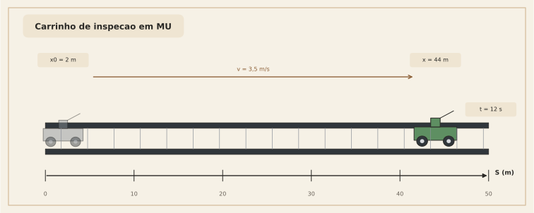
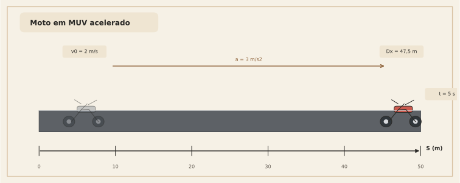
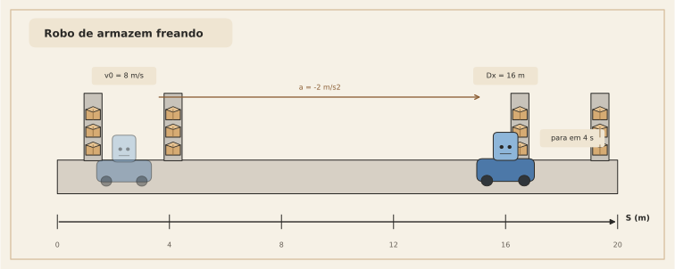

# 23. Exercícios propostos

Os exercícios abaixo foram pensados para treinar não só conta, mas leitura física e escolha de estratégia.

Antes de resolver, tente sempre identificar:

- qual grandeza é conhecida
- se o movimento é MU ou MUV
- que gráfico você imagina para a situação

## Exercício 1 — MU

Um carrinho de inspeção se move com velocidade constante de $3{,}5\ \text{m/s}$ a partir de $x_0 = 2\ \text{m}$.  
Qual sua posição após $12\ \text{s}$?

### Dica

Pergunte primeiro:

- a velocidade é constante?

Se sim, você já sabe em que família de movimento está.

---

## Exercício 2 — MUV acelerado

Uma moto parte com $v_0 = 2\ \text{m/s}$ e aceleração constante de $3\ \text{m/s}^2$.  
Determine:

1. a velocidade após $5\ \text{s}$
2. o deslocamento nesse intervalo

### Dica

Aqui vale separar as perguntas:

- uma pede velocidade
- a outra pede deslocamento

Nem sempre a mesma fórmula responde ambas diretamente.

---

## Exercício 3 — MUV retardado

Um robô de armazém está a $8\ \text{m/s}$ e freia com $a=-2\ \text{m/s}^2$.  
Determine:

1. o tempo para parar
2. a distância percorrida até parar

### Dica

A aceleração negativa não muda a família do problema.  
Ela apenas muda o sinal físico da variação.

---

## Exercício 4 — leitura geométrica

Explique, sem usar conta longa, por que o termo $\dfrac{1}{2}at^2$ aparece no MUV a partir do gráfico $v \times t$.

### Dica

Pense em decomposição de área, não em manipulação algébrica.

---
