# Curso de Cálculo para Cinemática  
## Limites, derivadas e integrais com foco em velocidade, MU e MUV

> **Recorte do curso:** este material não tenta ensinar “cálculo inteiro”.  
> Ele ensina o pedaço do cálculo que mais conversa com a cinemática do ensino médio e do início da engenharia:  
> **posição, velocidade, aceleração, inclinação de gráfico, área sob gráfico e as equações clássicas do MU/MUV**.

> **Epígrafe do curso:**  
> antes da fórmula, veja a geometria;  
> antes da conta, localize o movimento no eixo $S$.

---

## Como usar este arquivo no VS Code

Este arquivo foi escrito em **Markdown com LaTeX**.

- Fórmulas inline usam `$...$`
- Fórmulas em bloco usam `$$...$$`

Para visualizar bem no VS Code, o caminho mais confiável é usar uma extensão de preview com matemática, como:

- **Markdown Preview Enhanced**, ou
- qualquer preview com **KaTeX/MathJax**

As figuras estão em `./calc_cinematica_assets/`.

## Índice rápido

1. A ideia central: cálculo, na cinemática, é sobre duas perguntas
2. As três funções da cinemática
3. MU e MUV vistos pelos gráficos
4. Velocidade média e velocidade instantânea
5. Derivada sem exagero: só as regras que importam aqui
6. Aplicando derivada ao MU
7. Aplicando derivada ao MUV
8. O caminho inverso: integral como acúmulo
9. Integral no MU: por que $x = x_0 + vt$?
10. Integral no MUV: por que $x = x_0 + v_0 t + \frac{1}{2}at^2$?
11. A média das velocidades no MUV: por que ela funciona?
12. Integral formal mínima: só o que basta
13. O Teorema Fundamental do Cálculo, traduzido para a cinemática
14. Um comentário sobre curvas: só o necessário
15. Da geometria às fórmulas clássicas do ensino médio
16. Bônus útil: Torricelli via cálculo mínimo
17. Exemplos físicos completos
18. O papel dos gráficos em linguagem de engenharia
19. Uma sequência mental que funciona muito bem em problemas
20. Erros clássicos e como evitá-los
21. Mini-resumo das regras de cálculo que realmente usamos aqui
22. Folha de consulta compacta
23. Exercícios propostos
24. Gabarito dos exercícios
25. Fechamento

---

## Plano de ação do curso

A ideia aqui é construir o cálculo **de dentro da cinemática**, e não o contrário.

### Etapa 1 — Linguagem física antes da matemática
Primeiro vamos fixar o que são:

- posição $x(t)$
- velocidade $v(t)$
- aceleração $a(t)$

e como cada uma aparece nos gráficos.

### Etapa 2 — Limite como “aproximação da velocidade instantânea”
Vamos partir da **velocidade média** e apertar o intervalo de tempo até enxergar a **velocidade naquele instante**.

### Etapa 3 — Derivada como inclinação
Vamos mostrar que:

- derivar a posição dá a velocidade
- derivar a velocidade dá a aceleração

mas **apenas com as regras que realmente interessam** para MU e MUV.

### Etapa 4 — Integral como acúmulo / área
Vamos interpretar:

- área sob o gráfico de $v \times t$ como deslocamento
- área sob o gráfico de $a \times t$ como variação de velocidade

A partir daí, as fórmulas clássicas vão aparecer quase sozinhas.

### Etapa 5 — Fechamento em linguagem de engenharia
No final, você vai enxergar as fórmulas não como “coisas para decorar”, mas como **traduções geométricas** de inclinação e área.

---

# 1. A ideia central: cálculo, na cinemática, é sobre duas perguntas

Na cinemática, o cálculo nasce de duas perguntas muito concretas:

## Pergunta A — “quão rápido está mudando agora?”
Isso nos leva a **derivada**.

Exemplo físico:
- a posição do carro muda com o tempo;
- a taxa dessa mudança é a velocidade;
- se a velocidade muda, a taxa dessa mudança é a aceleração.

## Pergunta B — “quanto foi acumulado ao longo do tempo?”
Isso nos leva a **integral**.

Exemplo físico:
- se eu sei a velocidade a cada instante e quero saber quanto o corpo andou, eu acumulo isso ao longo do tempo;
- geometricamente, isso aparece como **área sob o gráfico**.

> Em linguagem curta:
>
> - **derivada** = taxa de variação
> - **integral** = acúmulo

Essa dupla é o coração da cinemática.

---

# 2. As três funções da cinemática

Na engenharia e na física, quase sempre pensamos em três funções do tempo:

$$
x = x(t), \qquad v = v(t), \qquad a = a(t)
$$

onde:

- $x(t)$ é a posição
- $v(t)$ é a velocidade
- $a(t)$ é a aceleração

## 2.1. Como ler isso fisicamente?

Quando você escreve $x(t)$, está dizendo:

> “a posição depende do tempo”.

Quando escreve $v(t)$:

> “a velocidade depende do tempo”.

E quando escreve $a(t)$:

> “a aceleração depende do tempo”.

Isso permite descrever desde uma esteira industrial em velocidade constante até um carro arrancando no semáforo.

---

# 3. MU e MUV vistos pelos gráficos

Antes do cálculo, vale fixar a geometria dos gráficos.

## 3.1. MU — Movimento Uniforme

No MU, a velocidade é constante.

$$
v(t) = v
$$

Então a posição cresce linearmente:

$$
x(t) = x_0 + vt
$$

> Por enquanto, leia essa expressão como o retrato algébrico do MU.
> A construção dela virá na seção 9, quando o deslocamento for lido como área sob o gráfico $v \times t$.

### Geometria do MU
- no gráfico $x \times t$, aparece uma **reta**
- no gráfico $v \times t$, aparece uma **linha horizontal**
- no gráfico $a \times t$, aparece a linha no zero

Gráfico $x \times t$:

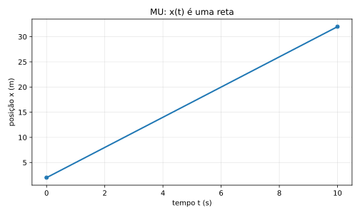

Gráfico $v \times t$:

Gráfico $a \times t$:

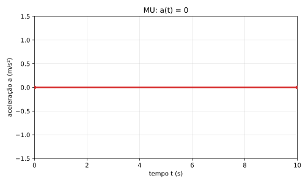

### Leitura física da inclinação
A inclinação dessa reta no gráfico $x \times t$ é a velocidade.

- reta mais inclinada $\Rightarrow$ maior velocidade
- reta menos inclinada $\Rightarrow$ menor velocidade
- reta descendo $\Rightarrow$ velocidade negativa

---

## 3.2. MUV — Movimento Uniformemente Variado

No MUV, a aceleração é constante.

$$
a(t) = a
$$

Logo, a velocidade varia linearmente com o tempo:

$$
v(t) = v_0 + at
$$

E a posição passa a variar quadraticamente:

$$
x(t) = x_0 + v_0 t + \frac{1}{2}at^2
$$

> Aqui ainda estamos apresentando o mapa do movimento, não a demonstração.
> A forma $v(t)=v_0+at$ será justificada na seção 12.2.
> A forma $x(t)=x_0+v_0 t+\frac{1}{2}at^2$ será construída na seção 10 e retomada formalmente na seção 12.1.

### Geometria do MUV
- no gráfico $a \times t$, temos uma linha horizontal
- no gráfico $v \times t$, temos uma **reta**
- no gráfico $x \times t$, temos uma **curva parabólica**

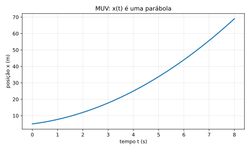

> Esse é um ponto importante:
>
> - no MU, posição é reta
> - no MUV, posição é curva
>
> Mesmo assim, ainda estamos dentro de um dos movimentos mais simples da física.

---

# 4. Velocidade média e velocidade instantânea

Aqui começa o cálculo de verdade.

## 4.1. Velocidade média

Em um intervalo de tempo $\Delta t$, a velocidade média é:

$$
v_{\text{méd}} = \frac{\Delta x}{\Delta t}
$$

Aqui aparecem duas abreviações:

- $\Delta x$ = variação de posição
- $\Delta t$ = variação de tempo

Se o intervalo começa no instante $t$ e termina no instante $t+\Delta t$, então:

- posição inicial = $x(t)$
- posição final = $x(t+\Delta t)$
- tempo inicial = $t$
- tempo final = $t+\Delta t$

Usamos agora duas ideias matemáticas bem simples:

1. variação = valor final $-$ valor inicial
2. a posição é dada por uma função do tempo, escrita como $x(t)$

Logo,

$$
\Delta x = x(t+\Delta t) - x(t)
$$

e

$$
\Delta t = (t+\Delta t) - t
$$

Substituindo essas duas escritas na fórmula compacta, obtemos:

$$
v_{\text{méd}}
=
\frac{x(t+\Delta t)-x(t)}{(t+\Delta t)-t}
=
\frac{x(t+\Delta t)-x(t)}{\Delta t}
$$

Essa forma parece mais carregada, mas não é uma nova fórmula.  
É a mesma velocidade média escrita em linguagem de função.

Na seção 4.2, vamos usar exatamente essa escrita para encolher o intervalo e chegar à velocidade instantânea.

Isso responde:

> “Em média, quanto a posição mudou por unidade de tempo nesse intervalo?”

### Exemplo físico
Imagine um carro entre dois postes de medição:

- em $t = 2\,s$, ele está em $x=30\,m$
- em $t = 5\,s$, ele está em $x=66\,m$

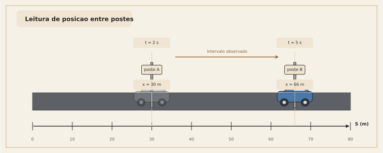

Então:

$$
v_{\text{méd}} = \frac{66-30}{5-2} = \frac{36}{3} = 12\ \text{m/s}
$$

Isso não significa necessariamente que ele estava a $12\ \text{m/s}$ o tempo todo.  
Significa apenas que **o efeito médio** naquele intervalo foi esse.

---

## 4.2. O salto conceitual: e se eu encolher o intervalo?

Agora vem a ideia de limite.

Se eu quiser a velocidade **num instante**, eu posso pegar um intervalo muito pequeno em torno daquele instante.

Em vez de olhar o comportamento entre tempos bem separados, eu olho assim:

$$
v_{\text{méd}} = \frac{x(t+\Delta t)-x(t)}{\Delta t}
$$

e vou tornando $\Delta t$ cada vez menor:

$$
\Delta t \to 0
$$

Quando esse processo funciona, nasce a **velocidade instantânea**:

$$
v(t) = \lim_{\Delta t \to 0}\frac{x(t+\Delta t)-x(t)}{\Delta t}
$$

Essa é a definição de derivada aplicada à posição.

> Em linguagem intuitiva:
>
> a velocidade instantânea é a velocidade média em um intervalo tão pequeno que ele “encosta” num único instante.

---

## 4.3. Visão geométrica: secante e tangente

No gráfico $x \times t$:

- a **velocidade média** é a inclinação da reta secante entre dois pontos
- a **velocidade instantânea** é a inclinação da reta tangente naquele ponto

### Leitura física
Isso é belíssimo porque une duas linguagens:

- linguagem física: “rapidez de mudança”
- linguagem geométrica: “inclinação da curva”

Na prática:

- inclinação grande $\Rightarrow$ velocidade grande
- inclinação nula $\Rightarrow$ velocidade zero
- inclinação negativa $\Rightarrow$ velocidade negativa

---

# 5. Derivada sem exagero: só as regras que importam aqui

Há muitas regras de derivação em cálculo.  
Mas, para MU e MUV, você precisa de um conjunto muito pequeno.

## 5.1. Regra 1 — derivada de constante

Se $c$ é constante,

$$
\frac{d}{dt}(c) = 0
$$

Exemplo físico:
- $x_0$ é posição inicial, número fixo
- então a taxa de variação de $x_0$ é zero

---

## 5.2. Regra 2 — derivada de $t$

$$
\frac{d}{dt}(t) = 1
$$

Logo, se houver uma constante multiplicando $t$:

$$
\frac{d}{dt}(kt) = k
$$

Isso é exatamente o que faz a velocidade constante aparecer no MU.

---

## 5.3. Regra 3 — derivada de $t^2$

$$
\frac{d}{dt}(t^2) = 2t
$$

Portanto,

$$
\frac{d}{dt}\left(\frac{1}{2}at^2\right) = at
$$

Esse é o pedaço-chave do MUV.

---

## 5.4. Regra 4 — derivada da soma

Se

$$
f(t) = g(t) + h(t)
$$

então

$$
f'(t) = g'(t) + h'(t)
$$

Na prática:

$$
\frac{d}{dt}\left(x_0 + v_0 t + \frac{1}{2}at^2\right)
=
\frac{d}{dt}(x_0)
+
\frac{d}{dt}(v_0 t)
+
\frac{d}{dt}\left(\frac{1}{2}at^2\right)
$$

---

# 6. Aplicando derivada ao MU

No MU:

$$
x(t) = x_0 + vt
$$

> Aqui a lei horária do MU entra como hipótese de trabalho para enxergarmos o papel da derivada.
> A origem geométrica dessa expressão será construída na seção 9.

Derivando em relação ao tempo:

$$
\frac{dx}{dt} = \frac{d}{dt}(x_0 + vt)
$$

Pelas regras acima:

$$
\frac{dx}{dt} = 0 + v = v
$$

Logo,

$$
v(t) = \frac{dx}{dt} = v
$$

ou seja, a velocidade é constante, como esperado.

### Interpretação
Isso mostra que a fórmula do MU já carrega, escondida, uma ideia de cálculo:

> a inclinação da reta posição-tempo é constante.

---

# 7. Aplicando derivada ao MUV

Agora pegue a fórmula:

$$
x(t) = x_0 + v_0 t + \frac{1}{2}at^2
$$

> Aqui a lei horária do MUV também entra primeiro como hipótese de trabalho.
> A construção geométrica dela aparece na seção 10, e a forma integral mínima aparece na seção 12.1.

Derivando:

$$
\frac{dx}{dt}
=
\frac{d}{dt}(x_0)
+
\frac{d}{dt}(v_0 t)
+
\frac{d}{dt}\left(\frac{1}{2}at^2\right)
$$

Logo:

$$
v(t) = 0 + v_0 + at
$$

portanto,

$$
v(t) = v_0 + at
$$

Agora derivamos de novo:

$$
\frac{dv}{dt} = \frac{d}{dt}(v_0 + at) = 0 + a
$$

portanto,

$$
a(t) = a
$$

Chegamos ao pacote completo:

$$
x(t) = x_0 + v_0 t + \frac{1}{2}at^2
$$

$$
v(t) = v_0 + at
$$

$$
a(t) = a
$$

> Esse trio é a cara do MUV.

---

# 8. O caminho inverso: integral como acúmulo

Derivada responde:

> “qual é a taxa de variação agora?”

Integral responde:

> “quanto foi acumulado ao longo do intervalo?”

Na cinemática, a leitura geométrica mais poderosa é:

- área sob o gráfico de $v \times t$ = deslocamento
- área sob o gráfico de $a \times t$ = variação de velocidade

Essa ideia vale em geral.  
Mas vamos focar primeiro em MU e MUV.

---

# 9. Integral no MU: por que $x = x_0 + vt$?

No MU, a velocidade é constante.

$$
v(t) = v
$$

Num intervalo de duração $t$, o gráfico $v \times t$ forma um retângulo.

A área é:

$$
\Delta x = v \cdot t
$$

Como posição final é posição inicial mais deslocamento:

$$
x = x_0 + \Delta x
$$

então:

$$
x = x_0 + vt
$$

Pronto: a fórmula do MU apareceu como **área de um retângulo**.

---

# 10. Integral no MUV: por que $x = x_0 + v_0 t + \frac{1}{2}at^2$?

Aqui está uma das partes mais importantes do curso.

No MUV,

$$
v(t) = v_0 + at
$$

> Se você quiser a origem dessa reta de velocidade partindo de $a(t)=a$, ela será construída na seção 12.2.
> Aqui vamos usá-la como entrada geométrica para montar a área sob o gráfico $v \times t$.

No gráfico $v \times t$, isso é uma reta.  
A área sob essa reta, de $0$ até $t$, é um trapézio.

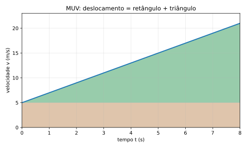

Podemos dividir essa área em duas partes:

## Parte 1 — retângulo
Altura $v_0$, base $t$:

$$
A_1 = v_0 t
$$

## Parte 2 — triângulo
A velocidade cresce de $v_0$ até $v_0+at$, então o “extra” é $at$.

Base $t$, altura $at$:

$$
A_2 = \frac{1}{2}\cdot t \cdot at = \frac{1}{2}at^2
$$

Somando:

$$
\Delta x = A_1 + A_2 = v_0 t + \frac{1}{2}at^2
$$

Logo,

$$
x = x_0 + \Delta x
$$

e portanto:

$$
x = x_0 + v_0 t + \frac{1}{2}at^2
$$

> Essa talvez seja a interpretação geométrica mais bonita do MUV:
>
> o termo $v_0 t$ é a parte “que já vinha andando”  
> e o termo $\frac{1}{2}at^2$ é o ganho extra vindo da aceleração.

---

# 11. A média das velocidades no MUV: por que ela funciona?

Uma dúvida muito comum é:

> “Por que no MUV podemos usar $\dfrac{v_0 + v}{2}$?”

A resposta curta é:

> porque o gráfico $v \times t$ é uma reta.

Quando a velocidade varia linearmente no tempo, a área do trapézio também pode ser escrita como:

$$
\Delta x = \text{velocidade média} \cdot t
$$

e a velocidade média é a média aritmética dos extremos:

$$
v_{\text{méd}} = \frac{v_0 + v}{2}
$$

Então:

$$
\Delta x = \frac{v_0 + v}{2}\,t
$$

Se quiser, substituímos $v = v_0 + at$:

$$
\Delta x = \frac{v_0 + (v_0 + at)}{2}\,t
$$

$$
\Delta x = \frac{2v_0 + at}{2}\,t
$$

$$
\Delta x = \left(v_0 + \frac{at}{2}\right)t
$$

$$
\Delta x = v_0 t + \frac{1}{2}at^2
$$

e recuperamos a fórmula clássica.

### O ponto conceitual importante
No MUV, a média das velocidades das pontas funciona porque a variação é linear.

Se o gráfico de $v(t)$ fosse uma curva arbitrária, essa média simples dos extremos **não seria** garantidamente a velocidade média real.

---

# 12. Integral formal mínima: só o que basta

Se você quiser escrever isso com linguagem de integral, fica assim:

## 12.1. Deslocamento a partir da velocidade

$$
\Delta x = \int_0^t v(\tau)\,d\tau
$$

Esse $\tau$ é só um nome para a variável de integração.  
Poderia ser outra letra.

No MUV:

$$
v(\tau) = v_0 + a\tau
$$

Então:

$$
\Delta x = \int_0^t (v_0 + a\tau)\,d\tau
$$

Usando as regras mais simples de integral:

$$
\int v_0\,d\tau = v_0\tau
$$

$$
\int a\tau\,d\tau = a\frac{\tau^2}{2}
$$

Logo,

$$
\Delta x = \left[v_0\tau + \frac{a\tau^2}{2}\right]_0^t
$$

Substituindo os limites:

$$
\Delta x = \left(v_0 t + \frac{at^2}{2}\right) - 0
$$

Portanto:

$$
\Delta x = v_0 t + \frac{1}{2}at^2
$$

e de novo:

$$
x = x_0 + v_0 t + \frac{1}{2}at^2
$$

---

## 12.2. Variação de velocidade a partir da aceleração

Da mesma forma:

$$
\Delta v = \int_0^t a(\tau)\,d\tau
$$

No MUV, $a(\tau)=a$ constante, então:

$$
\Delta v = \int_0^t a\,d\tau = a\int_0^t d\tau = a[t]_0^t = at
$$

Logo:

$$
v - v_0 = at
$$

portanto:

$$
v = v_0 + at
$$

> Isso mostra o papel da integral com clareza:
>
> - acumular aceleração ao longo do tempo dá variação de velocidade
> - acumular velocidade ao longo do tempo dá deslocamento

---

# 13. O Teorema Fundamental do Cálculo, traduzido para a cinemática

Em um curso formal de cálculo, existe um resultado central chamado **Teorema Fundamental do Cálculo**.

Aqui, em linguagem de cinemática, ele aparece quase assim:

## Se eu derivar a posição, obtenho a velocidade
$$
v(t) = \frac{dx}{dt}
$$

## Se eu acumular a velocidade no tempo, recupero deslocamento
$$
\Delta x = \int v(t)\,dt
$$

## Se eu derivar a velocidade, obtenho a aceleração
$$
a(t) = \frac{dv}{dt}
$$

## Se eu acumular a aceleração no tempo, recupero variação de velocidade
$$
\Delta v = \int a(t)\,dt
$$

Em linguagem bem direta:

> derivar “mede a taxa”  
> integrar “reconstrói o acúmulo”

Na cinemática, essas duas operações são praticamente a tradução matemática de “olhar inclinação” e “olhar área”.

---

# 14. Um comentário sobre curvas: só o necessário

Você pediu para trazer curva apenas o suficiente para introduzir integral.  
Então aqui vai o recorte certo.

Se $v(t)$ não for reta, mas uma curva qualquer, a regra geral continua válida:

$$
\Delta x = \int_{t_1}^{t_2} v(t)\,dt
$$

Geometricamente:

- área sob a curva de $v \times t$ = deslocamento

Mas, neste material, o foco principal é:

- MU: $v(t)$ constante
- MUV: $v(t)$ linear

Ou seja, mesmo sem entrar em movimentos complexos, você já ganha o pedaço mais útil do cálculo para a cinemática básica.

---

# 15. Da geometria às fórmulas clássicas do ensino médio

Agora vamos reorganizar tudo em forma de “caixa de ferramentas”.

## 15.1. MU

### Equação horária da posição
$$
x = x_0 + vt
$$

### Leitura em cálculo
- derivada de $x(t)$ dá $v$
- área sob $v(t)$ dá deslocamento

---

## 15.2. MUV

### Equação horária da velocidade
$$
v = v_0 + at
$$

### Equação horária da posição
$$
x = x_0 + v_0 t + \frac{1}{2}at^2
$$

### Velocidade média no MUV
$$
v_{\text{méd}} = \frac{v_0 + v}{2}
$$

### Deslocamento via velocidade média
$$
\Delta x = v_{\text{méd}}\,t
= \frac{v_0 + v}{2}\,t
$$

---

# 16. Bônus útil: Torricelli via cálculo mínimo

Essa parte é opcional, mas muito boa para engenharia porque elimina o tempo.

Queremos chegar em:

$$
v^2 = v_0^2 + 2a(x-x_0)
$$

Começamos de:

$$
a = \frac{dv}{dt}
$$

Mas também sabemos que:

$$
v = \frac{dx}{dt}
$$

Então podemos escrever:

$$
a = \frac{dv}{dt}
= \frac{dv}{dx}\cdot\frac{dx}{dt}
$$

Como $\dfrac{dx}{dt}=v$, fica:

$$
a = v\frac{dv}{dx}
$$

Reorganizando:

$$
v\,dv = a\,dx
$$

Se a aceleração for constante, integramos os dois lados:

$$
\int_{v_0}^{v} v\,dv
=
\int_{x_0}^{x} a\,dx
$$

Calculando:

$$
\left[\frac{v^2}{2}\right]_{v_0}^{v}
=
a[x]_{x_0}^{x}
$$

Logo:

$$
\frac{v^2 - v_0^2}{2} = a(x-x_0)
$$

Multiplicando por $2$:

$$
v^2 - v_0^2 = 2a(x-x_0)
$$

Portanto:

$$
v^2 = v_0^2 + 2a(x-x_0)
$$

> Essa derivação é muito valiosa porque mostra que Torricelli não é uma fórmula solta.
> Ela cai de um pedaço curto de cálculo com grande significado físico.

---

# 17. Exemplos físicos completos

Agora vamos usar tudo em cenários reais.

---

## Exemplo 1 — Esteira industrial em velocidade constante (MU)

Uma caixa entra numa esteira na posição inicial $x_0 = 1{,}2\ \text{m}$ e segue com velocidade constante de $0{,}8\ \text{m/s}$ por $15\ \text{s}$.

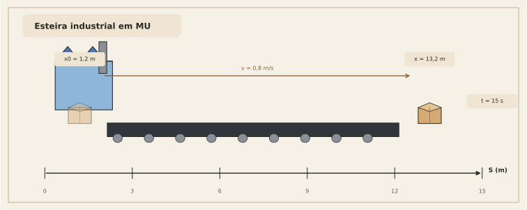

### Pergunta
Qual a posição da caixa após $15\ \text{s}$?

### Solução
No MU:

$$
x = x_0 + vt
$$

Substituindo:

$$
x = 1{,}2 + 0{,}8\cdot 15
$$

$$
x = 1{,}2 + 12
$$

$$
x = 13{,}2\ \text{m}
$$

### Leitura geométrica
No gráfico $v \times t$, isso é um retângulo com:

- base $15$
- altura $0{,}8$

Área:

$$
0{,}8\cdot 15 = 12
$$

Esse é o deslocamento.  
Depois somamos com a posição inicial.

---

## Exemplo 2 — Carro saindo do semáforo (MUV)

Um carro passa pelo semáforo com velocidade inicial $v_0 = 4\ \text{m/s}$ e aceleração constante $a = 2{,}5\ \text{m/s}^2$.  
Determine a velocidade e o deslocamento após $6\ \text{s}$.

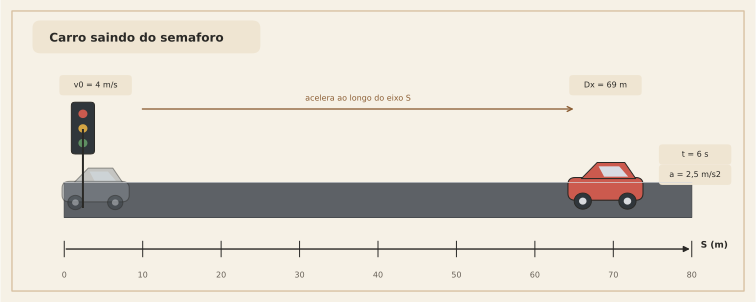

### Velocidade após 6 s
Usamos:

$$
v = v_0 + at
$$

$$
v = 4 + 2{,}5\cdot 6 = 4 + 15 = 19\ \text{m/s}
$$

### Deslocamento após 6 s
Usamos:

$$
\Delta x = v_0 t + \frac{1}{2}at^2
$$

$$
\Delta x = 4\cdot 6 + \frac{1}{2}\cdot 2{,}5\cdot 6^2
$$

$$
\Delta x = 24 + 1{,}25\cdot 36
$$

$$
\Delta x = 24 + 45 = 69\ \text{m}
$$

### Interpretação física
Dos $69\ \text{m}$:

- $24\ \text{m}$ vêm do pedaço “velocidade inicial mantida”
- $45\ \text{m}$ vêm do ganho extra causado pela aceleração

Essa separação ajuda muito a enxergar o significado da fórmula.

---

## Exemplo 3 — Empilhadeira freando (MUV com aceleração negativa)

Uma empilhadeira se move com velocidade inicial $v_0 = 6\ \text{m/s}$ e freia com aceleração constante $a = -1{,}5\ \text{m/s}^2$.

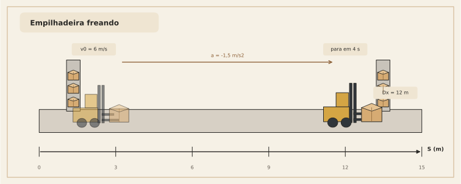

### Pergunta A
Quanto tempo leva para parar?

Usamos:

$$
v = v_0 + at
$$

No instante em que para, $v=0$:

$$
0 = 6 - 1{,}5t
$$

$$
1{,}5t = 6
$$

$$
t = 4\ \text{s}
$$

### Pergunta B
Qual a distância percorrida até parar?

$$
\Delta x = v_0 t + \frac{1}{2}at^2
$$

$$
\Delta x = 6\cdot 4 + \frac{1}{2}\cdot(-1{,}5)\cdot 4^2
$$

$$
\Delta x = 24 - 0{,}75\cdot 16
$$

$$
\Delta x = 24 - 12 = 12\ \text{m}
$$

### Interpretação
A aceleração negativa não “quebra” a fórmula.  
Ela apenas faz o termo quadrático atuar reduzindo o crescimento da posição.

---

## Exemplo 4 — Torricelli em frenagem

Um veículo está a $24\ \text{m/s}$ e freia com aceleração constante de $-4\ \text{m/s}^2$.  
Qual a distância mínima de frenagem até parar?

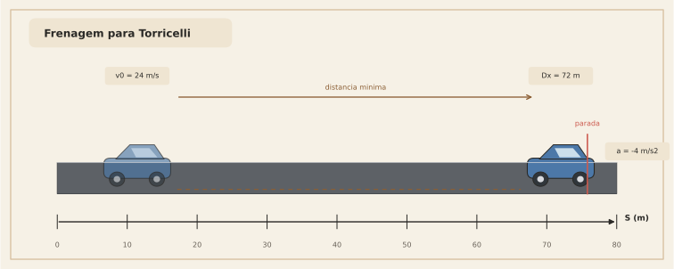

Usamos Torricelli:

$$
v^2 = v_0^2 + 2a(x-x_0)
$$

Quando o veículo para, $v=0$:

$$
0 = 24^2 + 2(-4)\Delta x
$$

$$
0 = 576 - 8\Delta x
$$

$$
8\Delta x = 576
$$

$$
\Delta x = 72\ \text{m}
$$

### Checagem cruzada
Também poderíamos fazer pelo tempo:

$$
0 = 24 - 4t \Rightarrow t=6
$$

Depois:

$$
\Delta x = 24\cdot 6 + \frac{1}{2}(-4)\cdot 6^2
$$

$$
\Delta x = 144 - 72 = 72\ \text{m}
$$

As duas rotas batem, como devem bater.

---

# 18. O papel dos gráficos em linguagem de engenharia

Na prática, em engenharia, olhar gráfico não é “enfeite”.  
É uma maneira de validar a equação sem decorar.

## 18.1. Gráfico $x \times t$
Pergunta respondida:

> “onde o corpo está?”

Leituras importantes:
- valor do gráfico = posição
- inclinação = velocidade

## 18.2. Gráfico $v \times t$
Pergunta respondida:

> “a que velocidade o corpo está se movendo?”

Leituras importantes:
- valor do gráfico = velocidade
- inclinação = aceleração
- área sob o gráfico = deslocamento

## 18.3. Gráfico $a \times t$
Pergunta respondida:

> “como a velocidade está mudando?”

Leituras importantes:
- valor do gráfico = aceleração
- área sob o gráfico = variação de velocidade

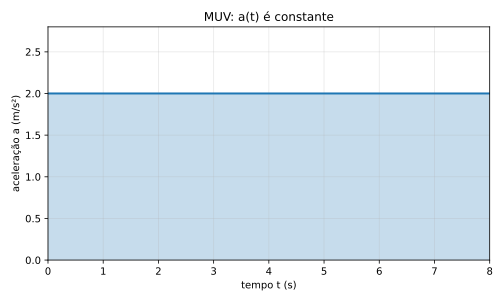

---

# 19. Uma sequência mental que funciona muito bem em problemas

Quando você pegar um exercício, use esta ordem:

## Passo 1 — descubra qual grandeza você conhece como função do tempo
Você recebeu:
- posição?
- velocidade?
- aceleração?

## Passo 2 — veja se o movimento é MU ou MUV
- velocidade constante $\Rightarrow$ MU
- aceleração constante $\Rightarrow$ MUV

## Passo 3 — pense em gráfico
Antes da fórmula, pergunte:
- isso é reta?
- isso é área?
- isso é inclinação?

## Passo 4 — só então escreva a equação
Use a equação como tradução do raciocínio geométrico, não como chute decorado.

---

# 20. Erros clássicos e como evitá-los

## Erro 1 — confundir velocidade média com velocidade instantânea
Correção:
- média usa intervalo
- instantânea usa limite / tangente

## Erro 2 — usar $\dfrac{v_0 + v}{2}$ fora do MUV
Correção:
- essa média simples vale quando $v(t)$ é linear no tempo

## Erro 3 — esquecer a interpretação de área
Correção:
- em $v \times t$, área = deslocamento
- em $a \times t$, área = variação de velocidade

## Erro 4 — tratar aceleração negativa como “fórmula diferente”
Correção:
- a fórmula é a mesma
- o sinal da aceleração cuida do sentido físico

## Erro 5 — decorar sem ler unidade
Correção:
- sempre cheque unidade:
  - $v_0 t$ tem unidade de comprimento
  - $at^2$ também tem unidade de comprimento
  - logo ambos podem ser somados em $x(t)$

### Checagem dimensional rápida
$$
[v_0 t] = \frac{m}{s}\cdot s = m
$$

$$
[at^2] = \frac{m}{s^2}\cdot s^2 = m
$$

Tudo consistente.

---

# 21. Mini-resumo das regras de cálculo que realmente usamos aqui

## Derivadas
$$
\frac{d}{dt}(c)=0
$$

$$
\frac{d}{dt}(t)=1
$$

$$
\frac{d}{dt}(t^2)=2t
$$

$$
\frac{d}{dt}[f(t)+g(t)] = f'(t)+g'(t)
$$

## Integrais
$$
\int c\,dt = ct + C
$$

$$
\int t\,dt = \frac{t^2}{2} + C
$$

$$
\int [f(t)+g(t)]\,dt = \int f(t)\,dt + \int g(t)\,dt
$$

## Tradução para a cinemática
$$
v = \frac{dx}{dt}
$$

$$
a = \frac{dv}{dt}
$$

$$
\Delta x = \int v(t)\,dt
$$

$$
\Delta v = \int a(t)\,dt
$$

> Dito isso, é possível usar várias outras regras práticas de cálculo.  
> **Mas, na cinemática básica, especialmente em velocidade, MU e MUV, esse conjunto já leva você às fórmulas clássicas do ensino médio sem sofrimento desnecessário.**

---

# 22. Folha de consulta compacta

## MU
$$
x = x_0 + vt
$$

- gráfico $x \times t$: reta
- gráfico $v \times t$: horizontal
- área em $v \times t$: deslocamento

## MUV
$$
v = v_0 + at
$$

$$
x = x_0 + v_0 t + \frac{1}{2}at^2
$$

$$
v_{\text{méd}} = \frac{v_0 + v}{2}
$$

$$
\Delta x = \frac{v_0 + v}{2}\,t
$$

$$
v^2 = v_0^2 + 2a(x-x_0)
$$

- gráfico $a \times t$: horizontal
- gráfico $v \times t$: reta
- gráfico $x \times t$: parábola

## Relações de cálculo
$$
v = \frac{dx}{dt}
$$

$$
a = \frac{dv}{dt}
$$

$$
\Delta x = \int v(t)\,dt
$$

$$
\Delta v = \int a(t)\,dt
$$

---

# 23. Exercícios propostos

## Exercício 1 — MU
Um carrinho de inspeção se move com velocidade constante de $3{,}5\ \text{m/s}$ a partir de $x_0 = 2\ \text{m}$.  
Qual sua posição após $12\ \text{s}$?

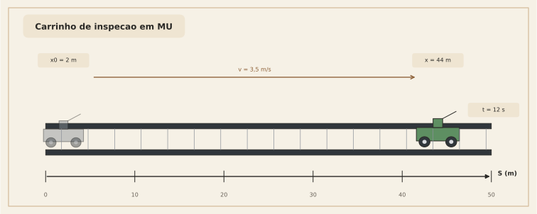

---

## Exercício 2 — MUV acelerado
Uma moto parte com $v_0 = 2\ \text{m/s}$ e aceleração constante de $3\ \text{m/s}^2$.  
Determine:
1. a velocidade após $5\ \text{s}$  
2. o deslocamento nesse intervalo

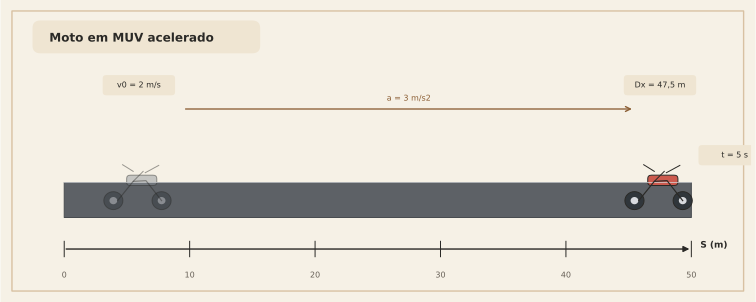

---

## Exercício 3 — MUV retardado
Um robô de armazém está a $8\ \text{m/s}$ e freia com $a=-2\ \text{m/s}^2$.  
Determine:
1. o tempo para parar  
2. a distância percorrida até parar

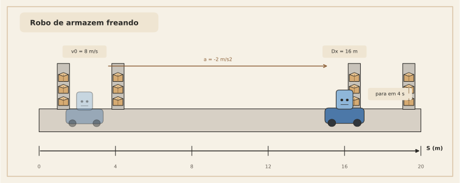

---

## Exercício 4 — leitura geométrica
Explique, sem usar conta, por que o termo $\dfrac{1}{2}at^2$ aparece no MUV a partir do gráfico $v \times t$.

---

# 24. Gabarito dos exercícios

## Exercício 1
$$
x = x_0 + vt = 2 + 3{,}5\cdot 12 = 44\ \text{m}
$$

## Exercício 2
### Velocidade
$$
v = v_0 + at = 2 + 3\cdot 5 = 17\ \text{m/s}
$$

### Deslocamento
$$
\Delta x = v_0 t + \frac{1}{2}at^2
= 2\cdot 5 + \frac{1}{2}\cdot 3\cdot 5^2
= 10 + 37{,}5
= 47{,}5\ \text{m}
$$

## Exercício 3
### Tempo para parar
$$
0 = 8 - 2t \Rightarrow t=4\ \text{s}
$$

### Distância
$$
\Delta x = 8\cdot 4 + \frac{1}{2}(-2)\cdot 4^2
= 32 - 16
= 16\ \text{m}
$$

## Exercício 4
Porque o gráfico $v \times t$ no MUV é uma reta;  
a área sob a reta pode ser decomposta em:
- um retângulo $v_0 t$
- um triângulo de área $\dfrac{1}{2}t\cdot at$

Logo o deslocamento total é:

$$
\Delta x = v_0 t + \frac{1}{2}at^2
$$

---

# 25. Fechamento

Se você guardar apenas uma visão deste material, guarde esta:

## Derivada é inclinação
- da posição sai a velocidade
- da velocidade sai a aceleração

## Integral é área / acúmulo
- da velocidade sai o deslocamento
- da aceleração sai a variação de velocidade

E, mais importante ainda:

> as fórmulas do MU e do MUV não são mágicas nem arbitrárias  
> elas são a forma algébrica de duas ideias geométricas:
> **inclinação** e **área**

Esse é o ponto em que cálculo deixa de parecer “matemática abstrata solta” e passa a parecer o que ele realmente é na cinemática:

> uma linguagem para medir mudança e acúmulo no mundo físico.

---
